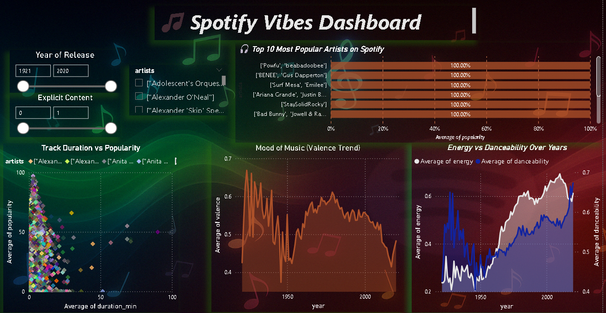

# 🎧 Project 04: Spotify Vibes – Power BI Dashboard

Designed an interactive Power BI dashboard to analyze over 160K Spotify tracks, uncovering trends in energy, danceability, mood (valence), and artist popularity over time.

---

## 📁 Project Files

- `spotify_data.xlsx` – Cleaned dataset used in Power BI  
- `spotify_dashboard.pbix` – Power BI dashboard file  
- `spotify_dashboard.png` – Screenshot of final dashboard  
- `README.md` – This file

---

## 🧰 Tools Used

- Power BI Desktop  
- Power Query Editor  
- DAX (Calculated Columns & Measures)  
- Git + GitHub

---

## 📊 Key Dashboard Features

- 🎯 **Slicers**: Year range, Explicit content, Artists  
- 📈 **Visuals**:
  - Energy vs Danceability over years (Dual-axis line chart)
  - Mood trend (Valence) across time  
  - Top 10 Most Popular Artists (Bar chart)  
  - Duration vs Popularity (Scatter plot)

- 🎨 **Theme**: Custom dark background with blurred Spotify vibes aesthetic  
- 📌 **Highlights**:
  - Responsive and visually appealing layout
  - Track-level insights made filterable in real time
  - Designed for storytelling and recruiter showcase

---

## 🔗 Dataset Source

[Kaggle – 160K Spotify Songs Dataset](https://www.kaggle.com/datasets/fcpercival/160k-spotify-songs-sorted/data)

---

## 📸 Dashboard Preview

---

## 🙋 Author

**Akhil**  
*Master’s in Data Science & Analytics (FAU)*  
[GitHub Profile](https://github.com/akhil0404-tech)
