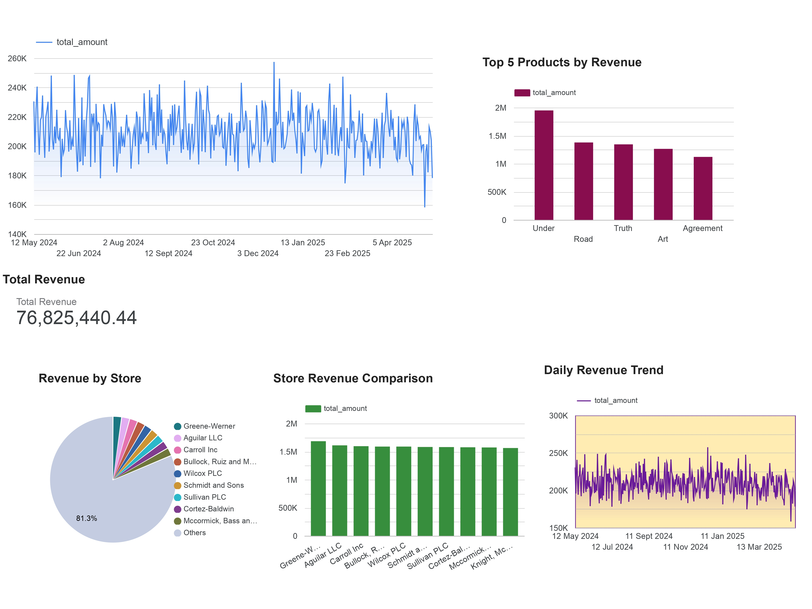

# 📊 Project 07: Retail Sales Intelligence Dashboard with BigQuery & Looker Studio

A real-time data warehouse and reporting solution built using Google BigQuery and Looker Studio. This project focuses on analyzing sales, product performance, and store revenue using large-scale retail data. The dashboard delivers business KPIs and sales trends with a dimensional star schema model and calendar-aware reporting.

---

## 📂 Folder Contents

- `sales.csv` – Fact table containing over 100,000 sales transactions
- `products.csv` – Product dimension with categories and pricing
- `customers.csv` – Customer dimension with demographics
- `stores.csv` – Store dimension with location info
- `date_dim.csv` – Calendar table for time-based joins
- `retail_sales_dashboard.jpg` – Screenshot of the live Looker Studio dashboard
- `LookerStudio_Link.txt` – Sharable dashboard link (view-only)
- `ERD.png` – ER diagram showing table relationships
- `kpi_queries.sql` – SQL scripts used to extract business metrics
- `README.md` – Project summary and key steps

---

## 🛠️ Tools Used

- Google BigQuery (SQL, Star Schema)
- Google Looker Studio (Dashboarding)
- Faker (Python-based data generation)
- dbdiagram.io (for ERD creation)
- Git + GitHub

---

## 📌 Key Tasks Performed

### ✅ 1. Data Modeling
- Created 1 fact and 4 dimension tables
- Simulated realistic sales data using Python (Faker)
- Loaded all tables into BigQuery using CSV uploads

### ✅ 2. Star Schema Design
- Central fact table: `sales`
- Dimensions: `products`, `customers`, `stores`, `date_dim`
- Joined with foreign keys to allow dynamic analysis

### ✅ 3. KPI SQL Development
- Total Revenue calculation
- Top 5 Products by Revenue (sales + products join)
- Revenue by Store (sales + stores join)
- Daily Sales Trend (sales + date_dim join)

### ✅ 4. Dashboard Build
- Connected BigQuery to Looker Studio
- Built Scorecards, Bar Charts, Pie Charts, and Time Series
- Added filters and styling for professional look

---

## 📸 Sample Output Preview

📷 Full Dashboard Screenshot → `retail_sales_dashboard.jpg`  
📐 ER Diagram of schema → `ERD.png`  
🔗 Looker Studio Public Link → `LookerStudio_Link.txt`

---
## 📸 Dashboard Preview

---

## 🙌 Author

**Akhil**  
*Master’s in Data Science & Analytics (Florida Atlantic University)*  
[GitHub Profile](https://github.com/akhil0404-tech)
